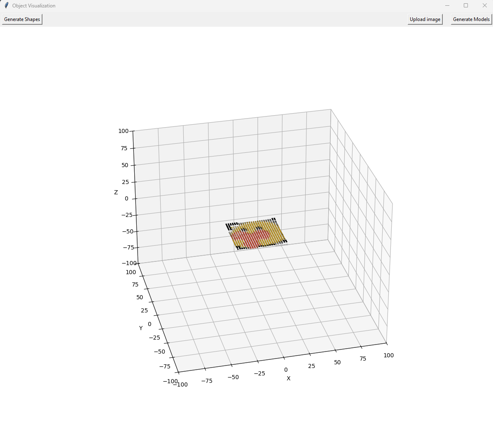

# ObjectVisualization

    

    

    

    Current supported features include random shapes displayed in a 3D plane, some preloaded 3D models created using the loaded shapes, and a rough 2D to 3D conversion.

    TO-DO: 
        - Remove transparent/white backgrounds from 2D images to create a cleaner figure
        - Create a rough outline of 2D image then fill in the center to create a nicer 3D model
        - Create info functions to calculate key points of 3D model including: 
            - total surface area of new model (most likely using the exposed faces of the blocks used to make up the model)
            - etc.
        - Save/load function for previously created models

